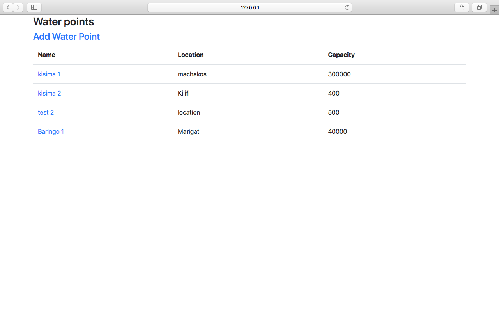
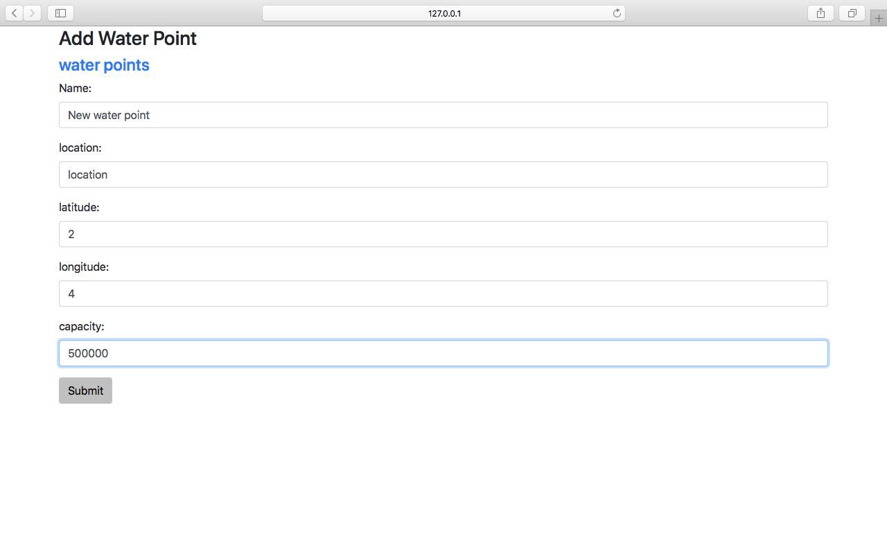
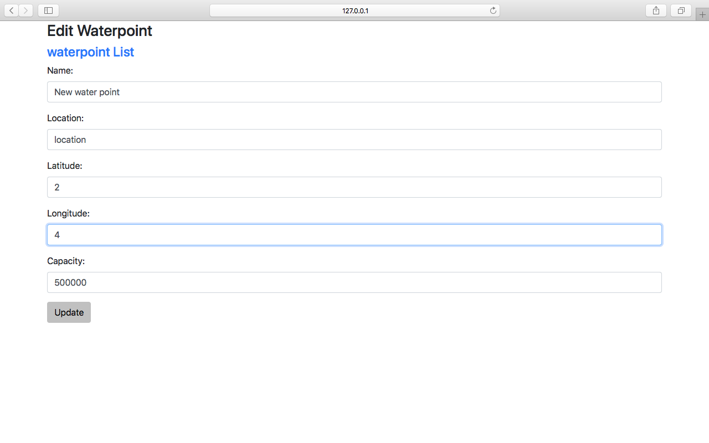
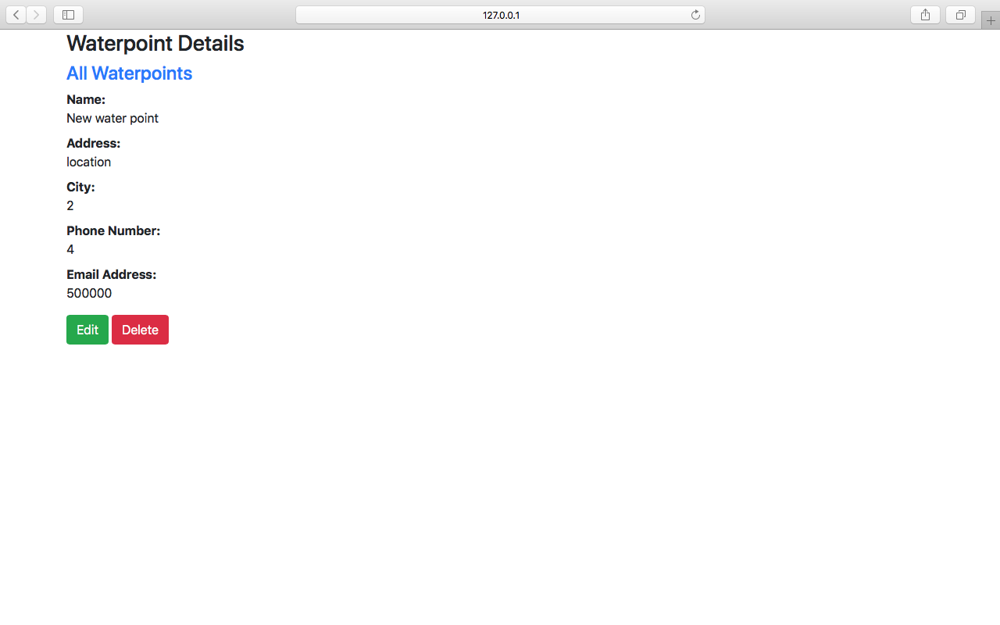

# Water Management System 

This water management system is aimed at making it easier for water officers to easily
add, update and delete water points from the system.

## Getting Started

The project is built using a Java Spring Boot back end and a React front end
The Database is MongoDB, found it useful and was in my learning objectives

### Prerequisites

You need to have Java 8 or 9 and Spring Framework 5.0.9.RELEASE or above, Gradle 4.x installed since I used Gradle and MongoDB


### Installing the project 

get a copy of this repo 

```
git clone https://github.com/254v0lkan/springbootapp.git
```
move into the folder 

```
cd springbootapp
```

Fire up your MongoDB

```
mongod
```

Fire up the back end

```
gradle bootRun
```

Fire up the front end


```
cd front end
npm start
```

The front end will be served via http://127.0.0.1:8080

This how it loks like 











## Built With

* [React](http://reactjs.org) - Front End
* [MongoDB](https://www.mongodb.com) - Database
* [SpringBoot](http://spring.io) - Back End

## Contributing

Feel free to contribute and improve on it


## License

This project is licensed under the MIT License - see the [LICENSE.md](LICENSE.md) file for details
